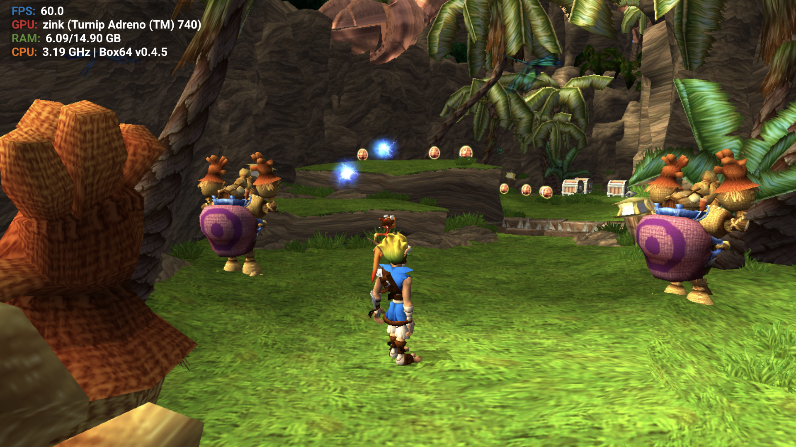
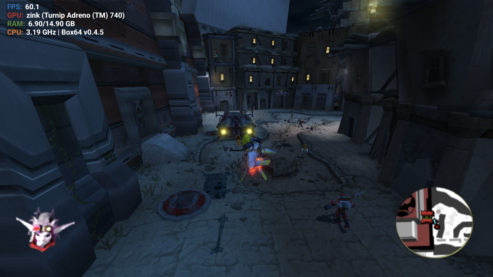
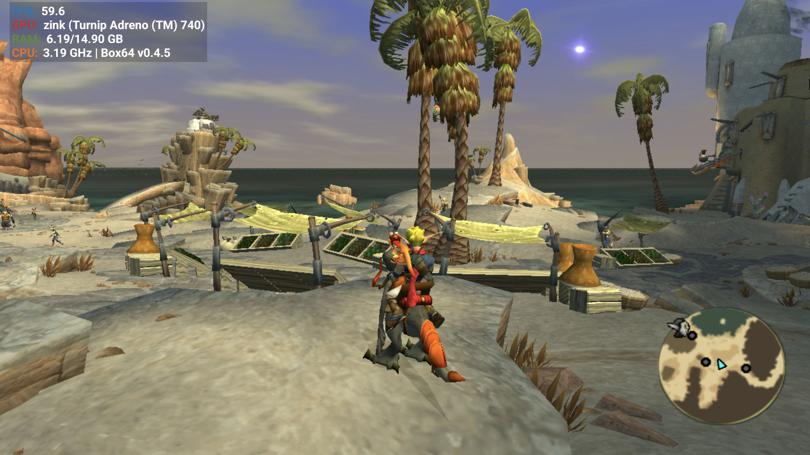
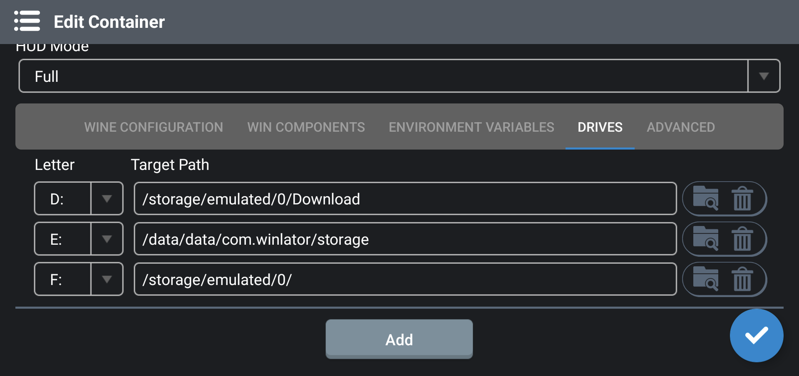
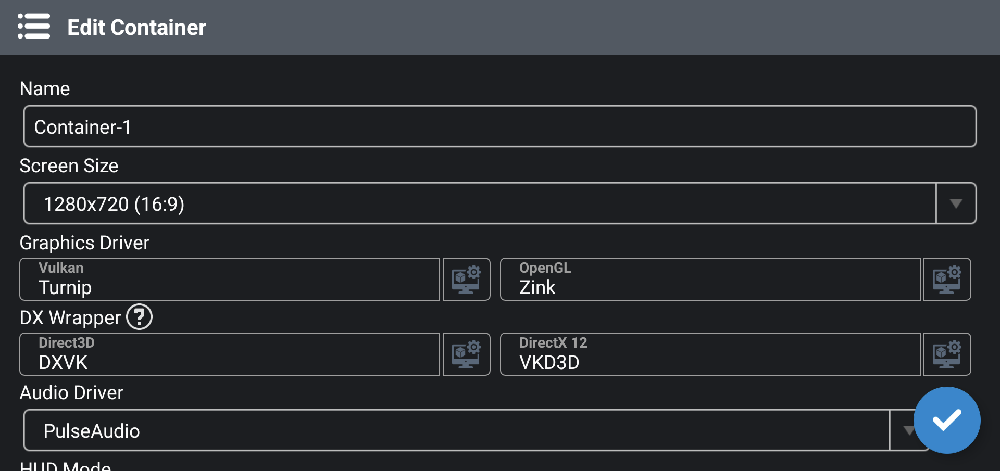
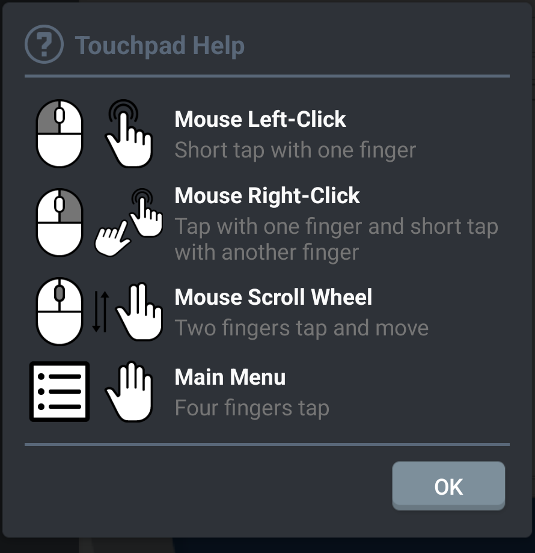

<p align="center">
	
</p>

# Winlator

Winlator is an Android application that lets you to run Windows (x86_64) applications with Wine and Box86/Box64.

# About this fork

This is a fork of [brunodev85/winlator](https://github.com/brunodev85/winlator), tuned specifically for running **OpenGOAL** (the open-source, reverse-engineered reimplementation of the Jak and Daxter engine, not the original Sony/Naughty Dog game code) well on Android handhelds like the AYN Thor. All credit for the base Winlator app goes to its original author and contributors; see [Credits and Third-party apps](#credits-and-third-party-apps) below. This fork does not distribute any copyrighted game assets. You need your own legally-owned copy of each game to use it, as explained in [Setting up an OpenGOAL game](#setting-up-an-opengoal-game-jak-1--jak-2--jak-3).

### Why Winlator?

Before landing on Winlator, GameNative, Winlator-based GameHub, and WinNative were all tried for running these games. All of these Android Wine wrappers use Mesa's Zink driver, which translates the game's OpenGL calls into Vulkan so they can run on the device's real GPU driver, and they all share the same codebase for that translation layer. Zink has a real, reproducible crash there: a synchronization assertion failure (`zink_synchronization.cpp`) that freezes the game after a while during normal play or cutscenes. It isn't tied to a specific Mesa version or a specific app's build, so GameNative, GameHub, and WinNative all hit it. Winlator was the one that didn't: the game ran completely stable, just slowly (around 25-31fps) on stock Winlator. That made it the right base to build on, since the remaining problem was just performance, fixed by this fork's box64 rebuild below, rather than a driver stability problem with no clear fix.

Changes on top of upstream:

- **Box64 0.4.5**, rebuilt from source against Winlator's bundled glibc rootfs (rather than the older 0.4.0 that ships upstream). Fixes a GLIBC symbol-version mismatch that made newer box64 builds crash silently on launch, and gives a real framerate improvement over 0.4.0: Jak II went from roughly 25-31fps to a stable 60fps on a Snapdragon 8 Gen 2 device.
- **Extreme Box64 preset**, a new dynarec preset (alongside the existing Stability/Compatibility/Performance ones) that disables `BOX64_DYNAREC_SAFEFLAGS` for a further speed boost on titles that tolerate it.
- **Home screen shortcuts**: any shortcut in the Shortcuts tab can be pinned directly to your device's home screen / launcher via its menu, so a game launches straight into its container without opening Winlator's own menu first.
- **Working gamepad vibration**: rumble capability is now detected live from the actual `Vibrator` hardware available (falling back to the system vibrator when a controller doesn't expose its own, which is the common case on integrated/handheld controllers) instead of requiring a manual "Enable Vibration" checkbox per player slot.

<p align="center">
	
	
	
	<br>
	<sub>Jak and Daxter, Jak II, and Jak 3, all running via OpenGOAL at a stable ~60fps on a Snapdragon 8 Gen 2 device</sub>
</p>

# Requirements

**On your Android device:**
- An Android device with an **ARM64 (arm64-v8a)** CPU. This is the only architecture this build supports.
- Android 8.0 (Oreo) or newer.
- A Vulkan-capable GPU (most modern Adreno/Mali GPUs qualify). This fork has been tested on a Snapdragon 8 Gen 2 (Adreno 740).
- Enough free storage for the games you want to play. Each OpenGOAL game's compiled data is several GB (Jak 3 was about 11GB in testing).
- A gamepad/controller is strongly recommended. Jak & Daxter games are built around analog stick and button input, and vibration support (see above) needs a real controller to feel it through.

**On a PC, one time per game, not needed to actually play afterward:**
- A Windows, Linux, or Intel Mac PC to run OpenGOAL's own extraction/decompile tools. See [Setting up an OpenGOAL game](#setting-up-an-opengoal-game-jak-1--jak-2--jak-3) below for why this step can't be done on the Android device itself.
- PowerShell, if you're on Windows and want to use this repo's [`prepare-opengoal-game.ps1`](scripts/prepare-opengoal-game.ps1) helper script. Windows PowerShell comes preinstalled on every version of Windows since Windows 7, so you almost certainly already have it. Not needed on Linux/Mac, or if you build the folder by hand.
- A way to get the compiled game folder onto your Android device: a USB cable, or a cloud storage service (Google Drive, etc.) if you'd rather not deal with cables. Only the compiled game data needs transferring this way; each person still has to extract their own copy from their own ISO, since that data can't be legally redistributed (see [About this fork](#about-this-fork)).
- Your own legally-owned copy of each Jak & Daxter game as an ISO.

# Installation

1. Download and install the APK from this fork's [Releases](../../releases) page
2. Launch the app and wait for the installation process to finish
3. Set up your OpenGOAL game(s) as described below and copy the resulting folder onto the device (no PC needed afterward, everything runs standalone once the files and APK are in place)

# Setting up an OpenGOAL game (Jak 1 / Jak 2 / Jak 3)

OpenGOAL doesn't run the original PS2 game disc directly. It needs to convert (decompile) your disc image into its own format first. **That conversion step needs a PC** and only has to be done once per game; playing afterward on the Thor needs no PC at all.

### Step 1: Get the OpenGOAL tools on your PC

1. Download the OpenGOAL Launcher from [opengoal.dev](https://opengoal.dev) and run it once, or grab a release directly from [github.com/open-goal/launcher](https://github.com/open-goal/launcher/releases).
2. There's no single fixed install location. Wherever you choose to install to (or wherever you extract the tools to, if you grabbed a standalone release instead of the Launcher), you'll end up with a folder that looks like this (the version number may differ):
   ```
   <wherever you installed it>/versions/official/<version>/
     ├── gk.exe          <- the game itself
     ├── goalc.exe
     ├── extractor.exe    <- the tool that converts your ISO
     └── data/
   ```
   This is the folder you'll point at in Step 3 (`-OpenGoalPath`). It's the one containing `gk.exe` directly, not any parent folder.
3. Not sure where yours ended up? Open the Launcher, go to **Settings**, and look for the installation directory field there. That's the folder to use, just append `versions/official/<version>` to it.

### Step 2: Convert your game disc (ISO) into OpenGOAL's format

You'll need a legally-owned copy of the game as an ISO. There are two ways to do this step, and the Launcher is the easier one for most people:

**Option A: the OpenGOAL Launcher (easier)**

Open the Launcher, select your game, and use its own Compile/Decompile buttons, pointing it at your ISO when asked. This does the same thing as the command below, just with a GUI. The [`prepare-opengoal-game.ps1`](scripts/prepare-opengoal-game.ps1) script in Step 3 automatically detects and handles the Launcher's install layout, so you can go straight to Step 3 afterward.

**Option B: `extractor.exe` from a terminal**

Open a terminal (cmd/PowerShell) in the folder from Step 1 and run:

```
extractor.exe -g jak1 -e -d -c -v "C:\path\to\your\Jak1.iso"
```

Swap `-g jak1` for `-g jak2` or `-g jak3` depending on the game, and point the last argument at your actual ISO file.

Either way, this step extracts, decompiles, and compiles the game. It can take several minutes and will use a lot of CPU. When it finishes without errors, the game's compiled data will be ready to use in Step 3.

### Step 3: Build the folder to copy onto your Thor

Only a subset of `data\` is needed per game, not the whole install, and it's easy to accidentally miss a required folder doing this by hand. A missing `data\game` folder, for example, causes a cryptic error like *"couldn't open .../data/game/graphics/opengl_renderer/shaders/solid_color.vert"*.

To make this foolproof, use the [`prepare-opengoal-game.ps1`](scripts/prepare-opengoal-game.ps1) script in this repo. Download that one file, open PowerShell, and run:

```powershell
.\prepare-opengoal-game.ps1 -OpenGoalPath "C:\path\to\OpenGOAL\versions\official\v0.3.5" -Game jak3 -OutputPath "C:\path\to\put\the\result"
```

- `-OpenGoalPath` is the versioned OpenGOAL folder from Step 1 (the one directly containing `gk.exe`), whichever option you used in Step 2. Run this *after* Step 2 has completed for that game.
- `-Game` is `jak1`, `jak2`, or `jak3`.
- `-OutputPath` is any folder where you want the result to appear (e.g. your Desktop).

If you'd rather just run `.\prepare-opengoal-game.ps1` with no arguments, PowerShell will prompt you for each value one at a time, and the game prompt spells out the valid options directly (`Game (jak1,jak2 or jak3):`).

The script copies only what's needed, builds the correct folder layout, and writes the launch `.bat` file for you. The result is a single self-contained folder (e.g. `Jak 3\`) ready for Step 5.

Ready-made `.bat` files for all three games (using the same paths this fork's own setup uses) are also available in [`scripts/`](scripts/) if you'd rather skip the script and drop one in by hand: [`launch_jak1_winlator.bat`](scripts/launch_jak1_winlator.bat), [`launch_jak2_winlator.bat`](scripts/launch_jak2_winlator.bat), [`launch_jak3_winlator.bat`](scripts/launch_jak3_winlator.bat).

<details>
<summary>Doing it by hand instead (click to expand)</summary>

Create a clean folder with this layout (this example is for Jak 3, replacing `jak3`/`Jak_3` with `jak1`/`Jak_1` or `jak2`/`Jak_2` as needed):

```
Jak 3/
  launch_jak3_winlator.bat
  Jak_3/versions/official/<version>/
    gk.exe
    goalc.exe
    data/
      game/                      <- shared engine assets (shaders, fonts), always needed
      imgui.ini
      launcher/
      decompiler/
      goal_src/
        common/, user/, goal-lib.gc, goos-lib.gs   <- shared, always needed
        jak3/                    <- only this game's folder
      iso_data/jak3
      decompiler_out/jak3
      out/jak3
      custom_assets/jak3
```

Then create `launch_jak3_winlator.bat` at the root of that folder:

```bat
@echo off
cd /d "F:\Jak 3\Jak_3"
versions\official\<version>\gk.exe -v --proj-path "versions\official\<version>\data" --game jak3 -- -boot -fakeiso
pause
```

Replace `<version>` with your actual OpenGOAL version folder name (e.g. `v0.3.5`). The `F:\` drive letter matches how Winlator maps your device's shared storage inside the container. If your setup uses a different drive letter, adjust it to match.
</details>

### Step 4: Copy it to your Thor

Copy the whole folder from Step 3 (including the `.bat` file) onto your device's internal storage, e.g. `/storage/emulated/0/Jak 3/`. You can do this over USB (drag-and-drop in a file manager, or `adb push`), or however you normally transfer files to the device.

### Step 5: Map the F: drive in your container

The generated `.bat` files all assume your container has an **F: drive mapped to `/storage/emulated/0/`** (the device's main shared storage), since that's what for example `cd /d "F:\Jak 3\Jak_3"` at the top of each `.bat` needs to resolve. Set this up once per container:

1. Open the container's settings (Edit Container) and go to the **Drives** tab.
2. Tap **Add**, pick a free letter (F: is what the generated `.bat` files expect by default), and set the Target Path.

<p align="center">
	
</p>

Winlator's folder picker (the icon next to the path field) won't let you select the true root of shared storage directly, for privacy reasons. Two ways around that:
- Use the picker to browse into any subfolder, confirm, then edit the resulting Target Path text field down to just `/storage/emulated/0/`, or
- Skip the picker entirely and just type `/storage/emulated/0/` straight into the Target Path field.

If you'd rather use a different letter than F:, that's fine, just edit the `cd /d "F:\..."` line in your `.bat` file (or the script's generated one) to match.

### Step 6: Set the container's graphics driver

Before the game will launch at all, your container's **OpenGL driver must be set to Zink**. OpenGOAL renders through OpenGL, and Zink is what translates that into Vulkan so it can actually run on the device's GPU. Without it, the game won't start.

In Winlator, open the container's settings (Edit Container) and set:

<p align="center">
	
</p>

- **Vulkan: Turnip**
- **OpenGL: Zink** (this is the one that matters most, the game won't launch without it)
- **DX Wrapper**: DXVK / VKD3D (defaults are fine, OpenGOAL doesn't use Direct3D directly)
- **Audio Driver**: PulseAudio

Feel free to copy the rest of the settings shown above as a starting point.

### Step 7: Run it in Winlator

1. Open Winlator, go into your container's file manager, and browse to where you copied the folder (it'll show up under the same drive Winlator maps your shared storage to).
2. Run `launch_jak3_winlator.bat`.
3. Once you've confirmed it launches correctly, save yourself from browsing to the file every time. Since this is a touchscreen acting as a mouse, "right-click" means a specific gesture, shown here (also available any time from the container's side menu under **Touchpad Help**):

<p align="center">
	
</p>

   Right-click the `.bat` file (tap with one finger, then a quick second tap with another finger) and choose **Create Shortcut**.
4. Back out of the container to Winlator's main screen, open the menu on the left side, and go to the **Shortcuts** tab. Your new shortcut will be there.
5. Tap the **⋮** on that shortcut and choose **Add to home screen** for one-tap launching straight from your device's home screen.

# Useful Tips

- If you are experiencing performance issues, try changing the Box64 preset to `Performance` in Container Settings -> Advanced Tab.
- For applications that use .NET Framework, try installing `Wine Mono` found in Start Menu -> System Tools -> Installers.
- If some older games don't open, try adding the environment variable `MESA_EXTENSION_MAX_YEAR=2003` in Container Settings -> Environment Variables.
- Try running the games using the shortcut on the Winlator home screen, there you can define individual settings for each game.
- To display low resolution games correctly, try to enabling the `Force Fullscreen` option in the shortcut settings.
- To improve stability in games that uses Unity Engine, try changing the Box64 preset to `Stability` or in the shortcut settings add the exec argument `-force-gfx-direct`.
- If you are experiencing audio crackling, try increasing the average latency in ALSA/PulseAudio configuration. Old games like Unreal Gold resolve audio issues by increasing this value to 90ms.

# Credits and Third-party apps

- OpenGOAL / jak-project by the [OpenGOAL team](https://github.com/open-goal/jak-project) ([opengoal.dev](https://opengoal.dev))
- GLIBC Patches by [Termux Pacman](https://github.com/termux-pacman/glibc-packages)
- Wine ([winehq.org](https://www.winehq.org/))
- Box86/Box64 by [ptitseb](https://github.com/ptitSeb)
- Mesa (Turnip/Zink/VirGL) ([mesa3d.org](https://www.mesa3d.org))
- DXVK ([github.com/doitsujin/dxvk](https://github.com/doitsujin/dxvk))
- VKD3D ([gitlab.winehq.org/wine/vkd3d](https://gitlab.winehq.org/wine/vkd3d))
- CNC DDraw ([github.com/FunkyFr3sh/cnc-ddraw](https://github.com/FunkyFr3sh/cnc-ddraw))

Special thanks to all the developers involved in these projects.<br>
Thank you to all the people who believe in this project.